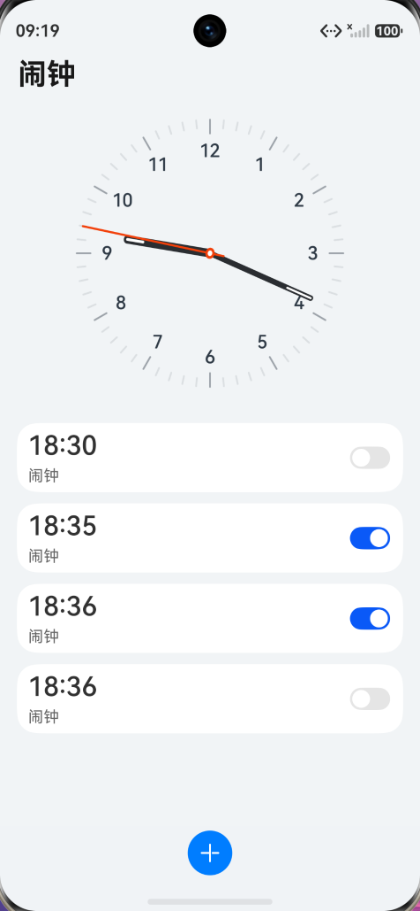
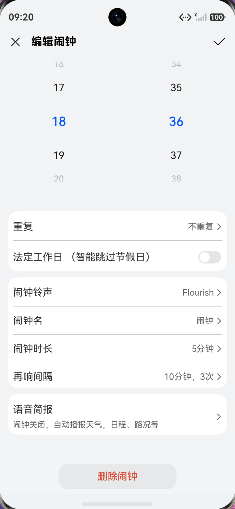
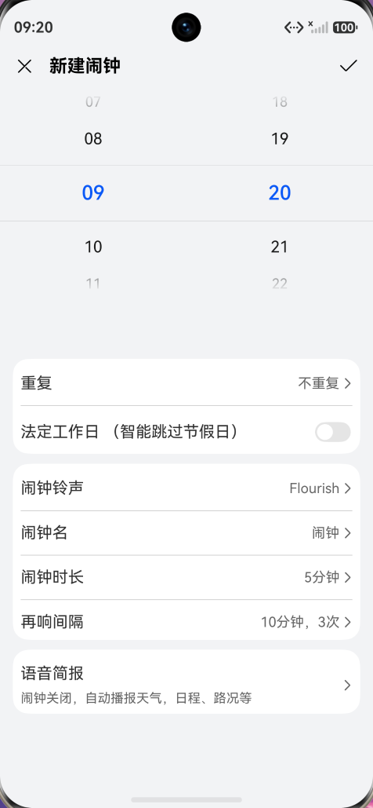

# HarmonyClock - 仿华为系统闹钟

<p align="center">
  
  
  
  
</p>

一款使用 ArkUI（HarmonyOS）开发的仿华为系统闹钟应用，采用华为时钟 UI 设计风格。

---

## 截图预览

|                            主页面                            |                           编辑闹钟                           |                           新建闹钟                           |
| :----------------------------------------------------------: | :----------------------------------------------------------: | :----------------------------------------------------------: |
|  |  |  |

---

## 功能特性

- **实时模拟时钟** - 使用 Canvas 绘制模拟表盘，实时显示时针、分针、秒针，每秒自动刷新
- **闹钟列表管理** - 集中展示所有已设置的闹钟
- **新建闹钟** - 通过时间选择器设置闹钟时间
- **编辑闹钟** - 修改已有闹钟的时间和其他设置
- **删除闹钟** - 点击闹钟进入编辑页删除
- **开关控制** - 通过 Toggle 开关快速启用/禁用闹钟
- **本地持久化** - 使用 Preferences 存储闹钟数据，应用重启后数据不丢失
- **通知权限管理** - 自动检查和请求通知权限

---

## 项目结构

```
entry/src/main/ets/
├── pages/
│   ├── Index.ets                    # 主页面（入口）
│   ├── Main/
│   │   ├── AIarmList.ets           # 闹钟列表组件
│   │   └── ClockArea.ets           # Canvas 模拟时钟
│   ├── Detail/
│   │   ├── NewAlarmClock.ets       # 新建闹钟页面
│   │   └── EditAlarmClock.ets      # 编辑闹钟页面
│   └── common/
│       ├── Notification/
│       │   ├── NotificationUtil.ets        # 通知管理工具（单例）
│       │   └── ReminderAgentUtil.ets       # 后台提醒代理工具
│       ├── Preferences/
│       │   └── PreferencesUtil.ets         # 本地存储工具（单例）
│       └── types/
│           └── NewAlarmClock_Types.ets     # 闹钟数据类型定义
├── entryability/
│   └── EntryAbility.ets             # 应用入口Ability
└── entrybackupability/
    └── EntryBackupAbility.ets       # 备份Ability
```

---

## 技术栈

| 技术 | 说明 |
|------|------|
| **ArkUI** | HarmonyOS 声明式 UI 开发框架 |
| **ArkTS** | TypeScript 的超集，ArkUI 专用开发语言 |
| **Canvas API** | 绘制实时模拟时钟表盘 |
| **@kit.NotificationKit** | 系统通知管理 |
| **@kit.BackgroundTasksKit** | 后台任务和提醒代理（预留） |
| **@kit.ArkData** | Preferences 本地数据持久化 |
| **Navigation** | 声明式路由导航 |

---

## 核心模块说明

### 1. 模拟时钟 (ClockArea.ets)

使用 Canvas 2D API 实现实时时钟绘制：

| 方法 | 功能 |
|------|------|
| `DrawPan()` | 绘制表盘背景 |
| `DrawHourPointer()` | 绘制时针（根据小时和分钟计算角度） |
| `DrawMinutePointer()` | 绘制分针 |
| `DrawSecondPointer()` | 绘制秒针 |
| `DrawClockArea()` | 清除画布并重新绘制整个时钟 |
| `StartDrawTask()` | 启动定时任务，每秒刷新一次 |

### 2. 通知管理 (NotificationUtil.ets)

单例模式的通知工具类：

| 方法 | 功能 |
|------|------|
| `isNotificationEnabled()` | 同步检查通知权限状态 |
| `requestNotificationPermission()` | 异步请求通知授权 |
| `openNotificationSettings()` | 打开系统通知设置页面 |
| `publishTextNotification()` | 发布普通文本通知 |
| `publishNotificationWithAction()` | 发布带跳转意图的通知 |
| `cancelNotification()` | 取消指定通知 |
| `setBadgeNumber()` | 设置应用角标数量 |

### 3. 本地存储 (PreferencesUtil.ets)

单例模式的数据持久化工具：

| 方法 | 功能 |
|------|------|
| `put(key, value)` | 保存数据到本地存储 |
| `get(key, defaultValue)` | 读取指定键的数据 |
| `delete(key)` | 删除指定键的数据 |
| `clear()` | 清空所有数据 |
| `has(key)` | 检查键是否存在 |

### 4. 闹钟数据类型 (NewAlarmClock_Types.ets)

```typescript
interface ReturnAlarmData {
  hour: string                    // 小时 (00-23)
  minute: string                  // 分钟 (00-59)
  repeat: boolean                 // 是否重复
  statutoryHoliday: boolean      // 法定工作日模式
  alarmRingtone: Resource        // 闹钟铃声资源
  alarmClockName: string         // 闹钟名称
  AlarmDuration: number           // 闹钟时长（分钟）
  RepeatingInterval: number[]    // 再响间隔配置
  isOpen: boolean                // 是否启用
  reminderId?: number            // 提醒代理ID（预留）
}
```

---

## 页面说明

### 主页面 (Index.ets)

- 顶部：Navigation 导航栏，显示"闹钟"标题
- 中部：ClockArea 组件，实时模拟时钟
- 下部：AIarmList 组件，闹钟列表
- 工具栏：添加按钮，点击进入新建闹钟页面

### 新建闹钟页面 (NewAlarmClock.ets)

- 时间选择器：24小时制时间选择
- 重复设置：设置闹钟重复模式
- 法定工作日：智能跳过节假日
- 铃声设置：选择闹钟铃声
- 闹钟名：自定义闹钟名称
- 闹钟时长：设置响铃持续时间
- 再响间隔：设置重复提醒间隔
- 语音简报：开启天气等信息播报

### 编辑闹钟页面 (EditAlarmClock.ets)

与新建闹钟页面功能相同，额外提供：

- 删除闹钟按钮：删除当前闹钟
- 时间初始化：自动填充原闹钟时间

---

## 注意事项

1. **代理提醒**：ReminderAgentUtil 模块已实现但因权限限制暂未启用，功能预留
2. **部分功能未实现**：重复设置，再响间隔，语音简报，铃声设置等

---

## 运行项目

1. 安装 [DevEco Studio](https://developer.huawei.com/consumer/cn/deveco-studio/)（HarmonyOS 开发工具）
2. 克隆项目到本地
3. 使用 DevEco Studio 打开项目
4. 连接 HarmonyOS 设备或启动模拟器
5. 点击运行按钮编译并安装

---

## License

MIT License

---

> 如果这个项目对你有帮助，欢迎 Star！
